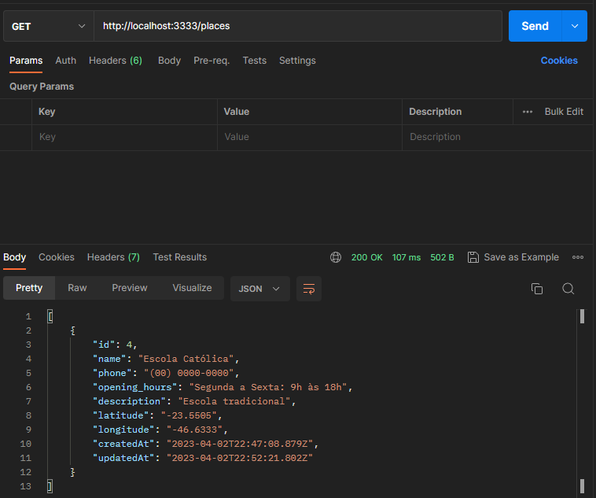
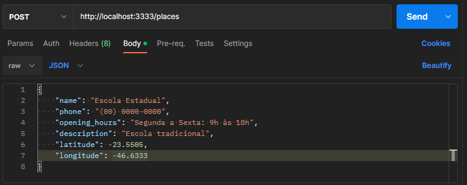
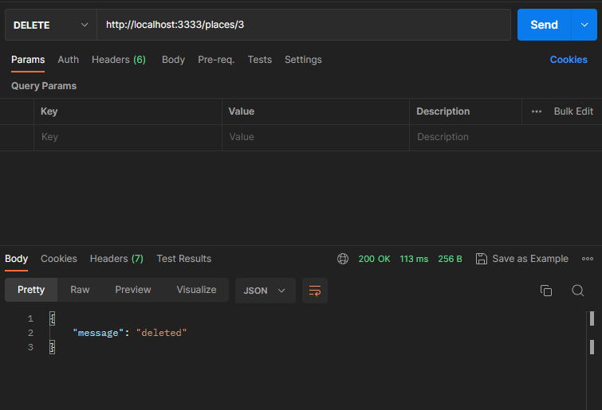
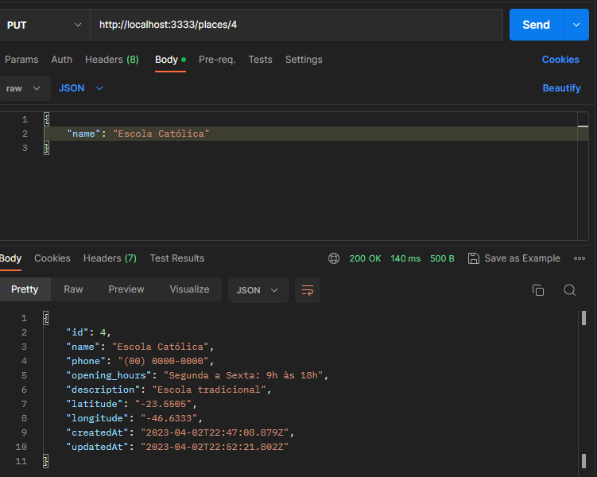

# Lab365
## Floripa Mais tec

Exercícios do Módulo 1 Semana 9 | Places API

### Build with
 -    
 - MVC Architecture

### How to test
execute `npm start` on terminal, the app will run on `localhost:3333/`

### Methods

